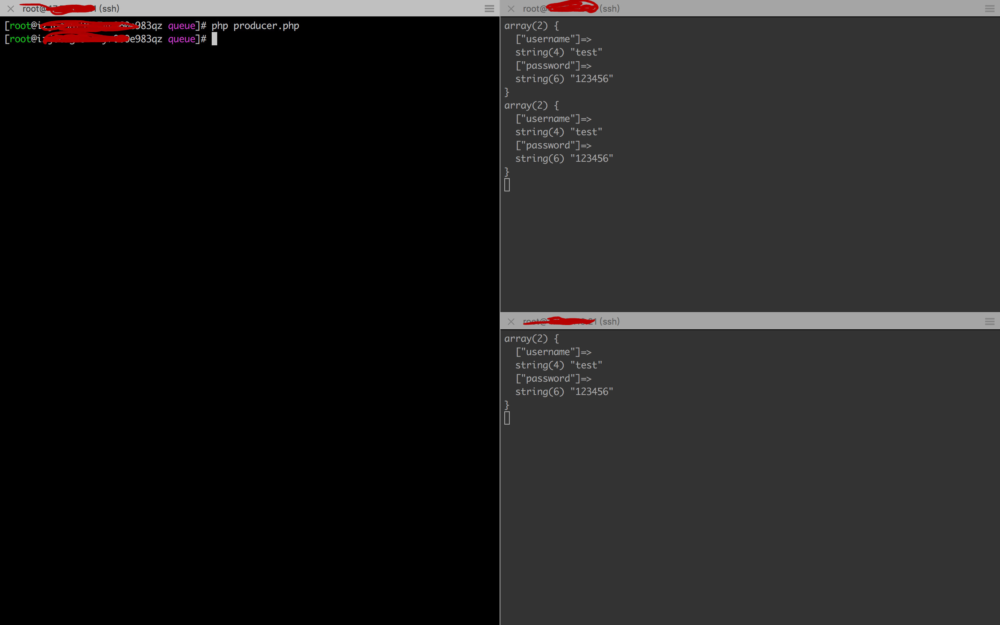
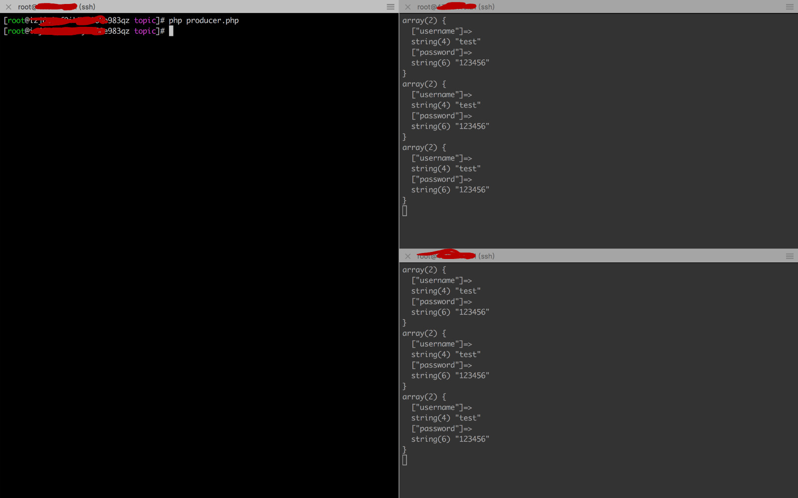

### 使用点对点(Point To Point)模型
点对点模型特点：
- 只有一个消费者可以接收到消息
- 不能重复消费

生产者```producer.php```代码：
``` php
<?php
try {
    // 1.建立连接
    $stomp = new Stomp('tcp://47.52.119.21:61613');
    // 2.实例化类
    $obj = new Stdclass();
    // 3.获取数据
    for($i=0; $i<3; $i++){
        $obj->username = 'test';
        $obj->password = '123456';
        $queneName     = "/queue/userReg";
        // 4.发送一个注册消息到队列
        $stomp->send($queneName, json_encode($obj));
    }
} catch (StompException $e) {
    die('Connection failed: ' . $e->getMessage());
}
```
消费者1```consumer1.php```代码：
``` php
<?php

$stomp = new Stomp('tcp://localhost:61613');
$stomp->subscribe('/queue/userReg');

while (true) {
    //判断是否有读取的信息
    if ($stomp->hasFrame()) {
        $frame = $stomp->readFrame();
        $data  = json_decode($frame->body, true);
        var_dump($data);
        $stomp->ack($frame);
    }
}
```
消费者2```consumer2.php```代码：
``` php
<?php

$stomp = new Stomp('tcp://localhost:61613');
$stomp->subscribe('/queue/userReg');

while (true) {
    //判断是否有读取的信息
    if ($stomp->hasFrame()) {
        $frame = $stomp->readFrame();
        $data  = json_decode($frame->body, true);
        var_dump($data);
        $stomp->ack($frame);
    }
}
```
执行结果图如下：

### 使用发布/订阅(Publish Subscribe)模型
发布/订阅模型特点：
- 多个消费者都可以收到消息
- 能重复消费

生产者```producer.php```代码：
``` php
<?php
try {
    // 1.建立连接
    $stomp = new Stomp('tcp://47.52.119.21:61613');
    // 2.实例化类
    $obj = new Stdclass();
    // 3.获取数据
    for($i = 0; $i < 3; $i++){
        $obj->username = 'test';
        $obj->password = '123456';
        $queneName     = "/topic/userReg";
        // 4.发送一个注册消息到队列
        $stomp->send($queneName, json_encode($obj));
    }
} catch (StompException $e) {
    die('Connection failed: ' . $e->getMessage());
}
```
消费者1```consumer1.php```代码：
``` php
<?php

$stomp = new Stomp('tcp://localhost:61613');
$stomp->subscribe('/topic/userReg');

while (true) {
    //判断是否有读取的信息
    if ($stomp->hasFrame()) {
        $frame = $stomp->readFrame();
        $data  = json_decode($frame->body, true);
        var_dump($data);
        $stomp->ack($frame);
    }
}
```
消费者2```consumer2.php```代码：
``` php
<?php

$stomp = new Stomp('tcp://localhost:61613');
$stomp->subscribe('/topic/userReg');
while (true) {
    //判断是否有读取的信息
    if ($stomp->hasFrame()) {
        $frame = $stomp->readFrame();
        $data  = json_decode($frame->body, true);
        var_dump($data);
        $stomp->ack($frame);
    }
}
```
执行结果图如下：

