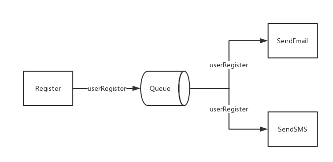
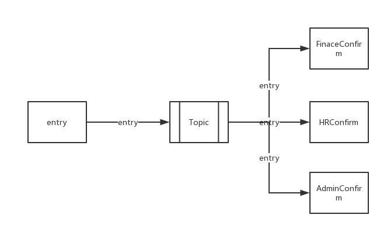

### 消息队列模型
消息队列模型主要有```点对点```和```发布/订阅```两种模型，这两种模型的主要区别是，```点对点模型```不能重复消费，而```发布/订阅模型```可以重复消费。

### 点对点模型(Point To Point)

生产者(Producer)将消息发送到队列(Queue)中，消费者(Consumer)从队列(Queue)中获取消息并消费掉。有以下特点：

- 消息被消费后，队列中将不在存储消息，顾消费者不能消费已经被消费掉的消息
- 队列支持多个消费者，但对一条消息，只会有一个消费者消费

模型图如下：


如模型所示：生产者```Register```将键值为```{"user_id" : 1, "email" : "qiaoweizhen@email.com", "mobile" : "188188818888"}```的消息发送到以```userRegister```为键的消息队列```Queue```中，有两个消费者```SendEmail```和```SendSMS```同时监听消息队列，只会有其中的一个收到消息并进行后续操作

### 发布/订阅(Publish/Subscribe Topic)

发布(Publish)/订阅(Subscribe)模式下，发布者将消息发送到消息队列中，多个消费者会接到通知。具有以下特点：

- 可重复消费
- 支持多个消费者

模型图如下：


如模型所示：发布者```entry```将键值为```{}```的消息发送到以```entry```为键的```Topic```中，同时有多个消费者```FinaceConfirm```、```HRConfirm```和```AdminConfirm```同时监听消息队列，都会收到消息并个自己进行后续操作